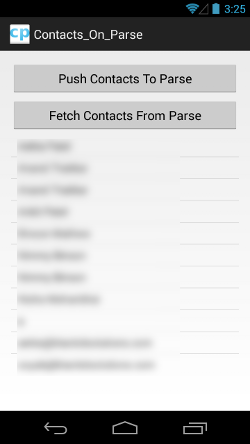
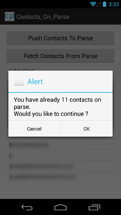
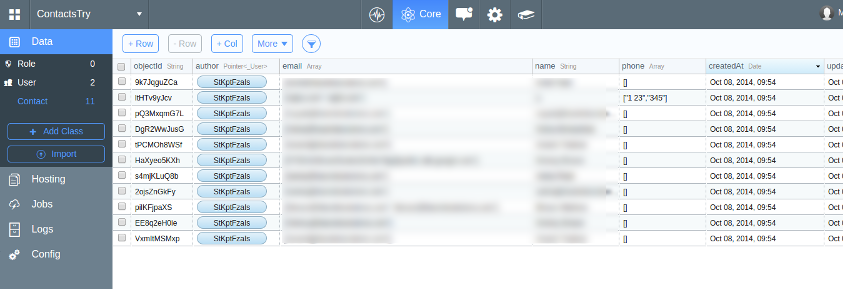

ParseContacts
=============

This is the sample of exporting android contacts to Parse. It also fetches those exported contacts from Parse App.

It Uses ParseLoginUI and Appcompat as library projects.

Features
--------

* Parse Login (FaceBook , Twitter)
* Relation of Contact to User and vice versa

Setup
-----

* Change your `strings.xml` file with your keys as follows in main project.

 ```xml
 <resources>
    <string name="parse_app_id">Your_App_ID</string>
    <string name="parse_client_key">Your_Parse_Client_ID</string>
    <string name="facebook_app_id">Your_facebook_App_Id</string>
    <string name="twitter_consumer_key">Your_Twitter_consumer_Key</string>
    <string name="twitter_consumer_secret">Your_Twitter_consumer_Secret</string>
 </resources>
 ```
* After successfull Run It'll look like






Good Luck and Happy Coding
--------------------------


